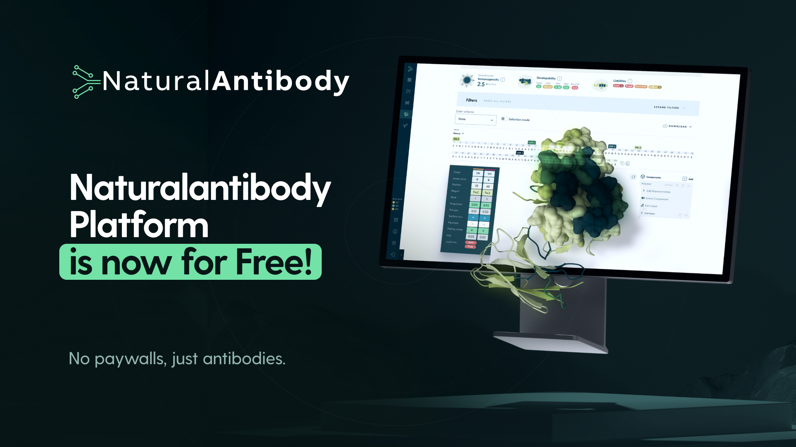

# NaturalAntibody Platform

This package provides an implementation of the on-premise version of the NaturalAntibody Platform. Use of this Software is subject to the [Standard Terms and the End User License Agreement (EULA)](https://github.com/NaturalAntibody/on-premise/blob/master/EULA.pdf). By downloading, installing, or using the Software, you acknowledge that you have read, understood, and agree to the [Standard Terms and Conditions](https://github.com/NaturalAntibody/on-premise/blob/master/STANDARD%20TERMS%20AND%20CONDITIONS.pdf) and [End-User License Agreement](https://github.com/NaturalAntibody/on-premise/blob/master/LICENCE).

NaturalAntibody Platform is available for commercial and non-commercial use. You can learn more about our Platform at [naturalantibody.com](https://naturalantibody.com/).

If you have any questions, please contact the NaturalAntibody team at [contact@naturalantibody.com](mailto:contact@naturalantibody.com).


## About NaturalAntibody Platform
NaturalAntibody is a computational platform that facilitates antibody discovery and design. It combines Antibody Database with modules for annotating and predicting antibody characteristics such as mutability and developability.

The Platform version consists of four main modules:

*   Antibody Database - to find antibody-related information in all major external databases (e.g. patents, GenBank, therapeutics etc.).
*   Sequence Engineering - optimization of single sequences, e.g. humanization, liabilities removal.
*   Batch Sequence Annotation with Clustering - filtering and clustering of repertoire data by computationally annotated liabilities for improved candidate selection.
*   Structure Modeling - create a 3D model of your antibody structure using the latest deep learning methods.
*   Antibody Docking - given structures of an antibody (ligand) and antigen (receptor) generate a number of possible binding orientations (decoys) sorted by predicted quality metric of molecular interface.


## Installation and Running Platform

See the [Setup for NaturalAntibody On Premise](https://github.com/NaturalAntibody/on-premise/blob/master/Setup%20for%20NaturalAntibody%20On%20Premise.pdf) pdf. Document outlines how to create a setup to run dockers that are needed to run our application in your environment. All the examples are based on how we did it with our infrastructure, but it should be as much service-agnostic as possible. In your case, some resources might have to be adjusted.

We will provide you with an example of Kubernetes manifests. In this document we will sometimes reference names of those manifests when discussing applying it. We are using Fargate and EC2 for this setup.

To create your own instance of the application and access our data stored on AWS S3 as well as images of the platform, please follow the steps below:

1. Ensure AWS Access

Make sure you have an AWS account with the necessary permissions to access our resources and that the AWS CLI is properly configured on your local environment.
You can verify your setup by running:

```aws sts get-caller-identity```

2. Authenticate with Amazon ECR

Before you can pull containers images from our Elastic Container Registry (ECR), you must first authenticate your client with AWS.
Run the following command (replace the region if needed):

 ```aws ecr get-login-password --region eu-central-1 | docker login --username AWS password-stdin 071253002612.dkr.ecr.eu-central-1.amazonaws.com```

3. Pull application containers

Once authenticated, you can pull the required containers stored on ECR repository using:

```docker pull 071253002612.dkr.ecr.eu-central-1.amazonaws.com/<image-name>:<tag>```

4. Access S3 Data

After successful authentication, you can use AWS CLI or SDKs to download the necessary datasets or configuration files from our S3 bucket.
These steps ensure your environment is properly connected and authorized to access all the resources required to run your own instance of the platform.